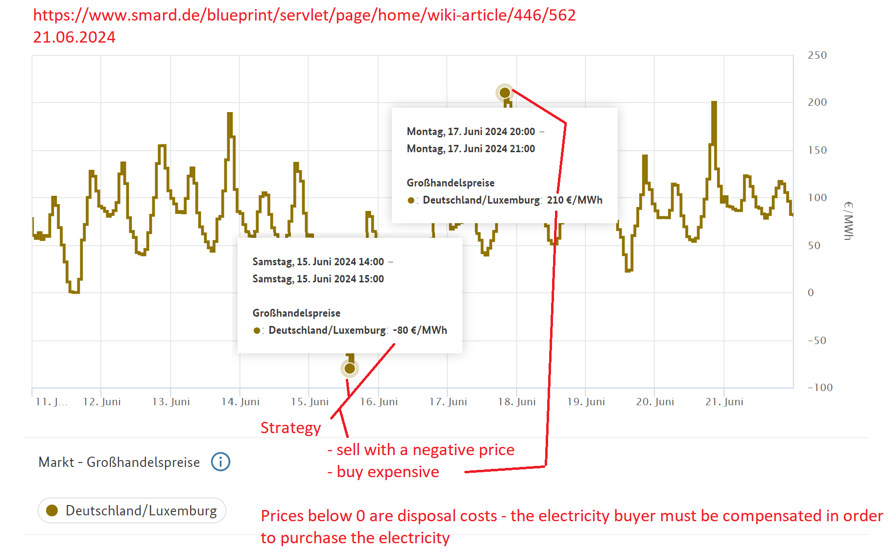

## German electricity import and export

The following image was taken from the page [Analysetool von stromdaten.info](https://www.stromdaten.info/ANALYSE/importexport/index.php)

### Wholesale prices
From [smard.de - wholesale prices](https://www.smard.de/page/en/wiki-article/5884/5976)

> The wholesale electricity price is the basic purchase price for electricity which is traded on the exchange and over-the-counter.

**Prices June 2024**

**Prices August 2024**

**Prices November 2024**

          

### Electricity generation installed capacity

From [smard.de / market data](https://www.smard.de/page/en/marktdaten/78?marketDataAttributes=%7B%22resolution%22:%22year%22,%22region%22:%22DE%22,%22from%22:1420066800000,%22to%22:1705273199999,%22moduleIds%22:%5B3000186,3000187,3000188,3000189,3000190,3000194,3000195,3000196,3000197,3000198,3000199,3000207,3003792,3004076,3004073,3004072,3004075,3004074%5D,%22selectedCategory%22:3,%22activeChart%22:true,%22style%22:%22color%22,%22categoriesModuleOrder%22:%7B%7D%7D) was this taken

Electricty installed 2024-08

## Europe prices

The [ACER Market Integration 2024](https://www.acer.europa.eu/sites/default/files/documents/Publications/ACER_2024_MMR_Market_Integration.pdf) has this chart on page 5

<figure>
  
  <figcaption>Number of low-price events and average day-ahead prices across all EU-27 bidding 
zones, 2019-2023</figcaption>
</figure>

The number of hours when prices are below EUR 5 /MWh are increasing due to the fact that renewable energy at least in germany:

> Negative electricity prices usually occur in periods when there is high wind and/or solar photovoltaic generation ([smard.de](https://www.smard.de/page/en/wiki-article/5884/105426))

# Gas prices

## Consumerprice index in switzerland
This graph shows the development of end consumer prices for gas indexed according to the national consumer price index in Switzerland. The basis is the prices in December 2020 (=100) [source](https://www.energiedashboard.admin.ch/preise/gas)

